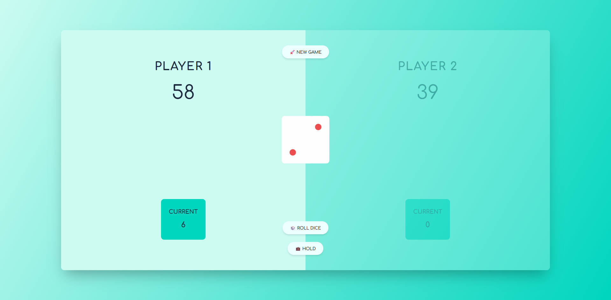

# 🐽 Pig Game

[](#)

> The Pig Game is a classic multiplayer dice game. The goal is to reach 100 points before your opponent.



### Project Mechanics:
* **Roll the Dice:** Players take turns rolling a dice.
* **Risk:** If a player rolls a **1**, they lose all current points accumulated during that turn, and the turn automatically passes to the other player.
* **Holding Points:** A player can choose to "Hold" at any time, adding his turn's current score to his global score.
* **Winning Condition:** The first player to reach a total of **100 points** is the winner.

---

## 🛠️ Tech Stack

The following technologies were used to build this project:

| Technology | Purpose |
| :--- | :--- |
| **Node.js** | JavaScript runtime environment. |
| **HTML5** | Structural foundation. |
| **CSS3** | Responsive web design. |
| **JavaScript (ES6+)** | Core game logic, state management, and DOM updates. |
| **NPM** | Dependency management and scripts. |

---

## 🍃 Installation & Requirements

### Prerequisites

To run this project locally, you must have **Node.js** installed. You can check your version by running `node -v` in your terminal.

1.  **Clone the repository:**
    ```bash
    git clone [https://github.com/EvolvedAdrian/pig-game.git](https://github.com/EvolvedAdrian/pig-game.git)
    ```
2.  **Navigate to the directory:**
    ```bash
    cd pig-game
    ```
3.  **Install dependencies:**
    ```bash
    npm install
    ```

---

## 💻 Usage

Start the application using:

```bash
npm run start
```

---

## Author

👤 **Adrián**

* Github: [@EvolvedAdrian](https://github.com/EvolvedAdrian)
